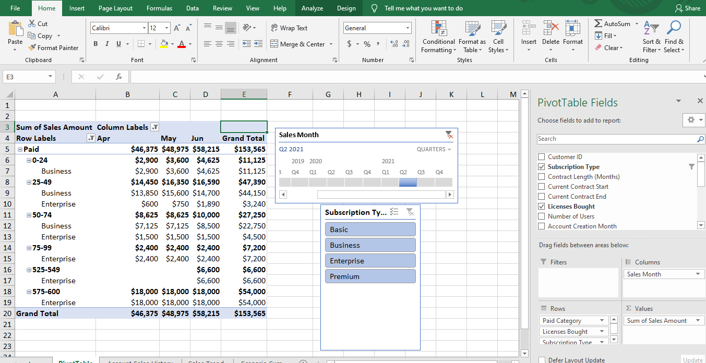
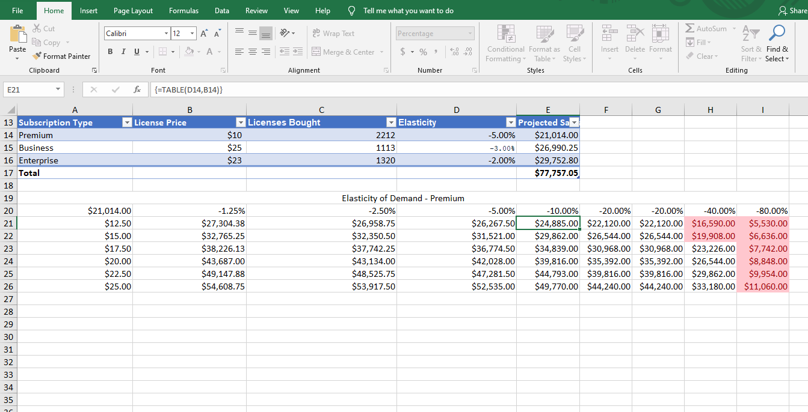

# Excel Sales Data Analysis Project

## Overview
Analysis of company sales data using Microsoft Excel to uncover trends,
perform scenario analysis, and build forecasts.

## File
`your-actual-filename.xlsx` — contains the following sheets:
- **Sheet 1: Exploratory Analysis** — PivotTables by segment and month
- **Sheet 2: Scenario Analysis** — Pricing scenarios and impact modeling
- **Sheet 3: Forecasting** — Moving averages and Excel Forecast Sheet

## Tools Used
- PivotTables | SUMIF / SUMIFS | IF / IFS
- Scenario Manager | Goal Seek | Data Tables
- FORECAST.ETS | Moving Averages

## Screenshots

### PivotTable Analysis

### Forecast Chart

### Scenario Analysis

## Key Insights
- Enterprise customers contributed the highest revenue
- Sales per customer declined due to fewer enterprise clients
- Forecasting models predict continued growth over the next year

## Author
Wisdom Oghenevwede Uti
